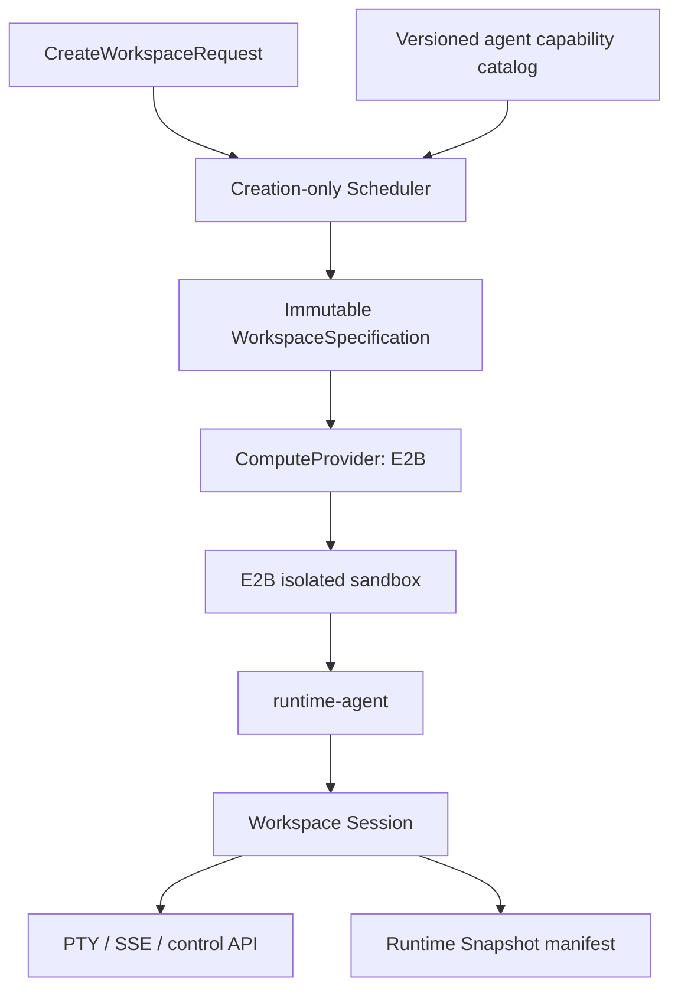

# E2B Provider Spike — research, contract, and verification gate

> **Status: implementation and local contract tests complete; real-sandbox
> acceptance blocked on E2B credentials and the pinned template.** This document
> records authoritative E2B API research and the exact evidence still required
> before Runtime can claim E2B support is verified. The provider is wired behind
> the provider-neutral compute seam, but it has not been exercised on E2B. It is
> disabled by default; deployment additionally requires `RUNTIME_ENABLE_E2B=true`.

Runtime is a workload-agnostic execution platform. E2B is an **isolated
Workspace Session substrate**; this work must never introduce security,
research, browser-automation, evaluation, proof, or consumer-specific concepts
into Runtime.

## Entry gate

E2B deployment and rollout require all of the following conditions. The
provider remains disabled until they are met; local contract coverage is not
evidence that an E2B Runtime Computer works in production:

1. M3 has passed its authenticated real-Daytona Workspace Session acceptance
   test.
2. M4 has passed its authenticated real-Daytona archive/replay/restore
   acceptance test.
3. Runtime has passed the measurable dogfood gate in
   [`PROGRESS.md`](./PROGRESS.md#flexible-workloads--e2b--blocked-on-the-entry-gate).
4. The provider-neutral `ComputeProvider` seam was extracted without changing
   current Daytona behavior.

E2B is not a shortcut around those gates. It is the first consumer of their
stable execution, agent, and snapshot contracts. Consult
[`PROGRESS.md`](./PROGRESS.md) and the linked real-provider reports for the
current status of the Daytona and dogfood prerequisites.

## Immutable placement model

The scheduler runs **once**, when creating a workspace. It receives a creation
request, resolves a provider/topology, and persists one immutable, normalized
workspace specification:

```ts
type CreateWorkspaceRequest = {
  topology: "shared" | "isolated";
  capabilities: CapabilityName[];
  providerOverride?: ProviderName;
  resources?: ResourceRequest;
};

type WorkspaceSpecification = {
  topology: "shared" | "isolated";
  capabilities: CapabilityName[];
  provider: ProviderName;
  resources: ResourceRequest;
  capabilityManifestVersion: string;
  agentImageVersion: string;
};
```

`WorkspaceSpecification` is the workspace's persisted identity. It is never
mutated, migrated, rebalanced, or re-scheduled. A request with different
requirements creates a new workspace. Archive and restore use the recorded
specification and provider; they never re-run placement.

Capabilities are machine-owned. The Go runtime-agent is the authoritative
definition for capability names and manifests. Since scheduling happens before
the agent is provisioned, the agent build must emit a versioned, immutable
capability catalog that the scheduler can read as generic substrate metadata.
The TypeScript control plane must not gain Docker behavior or domain knowledge.

## What E2B documentation establishes

The following are vendor-documented facts, **not yet Runtime-verified facts**:

| Concern | Documented E2B behavior | Runtime consequence |
| --- | --- | --- |
| Sandbox substrate | E2B templates run a Linux environment with an LTS 6.1 kernel; template builds snapshot the prepared filesystem and running processes. | An isolated, pre-baked Runtime Computer image is viable. Pin the template/image version in the persisted workspace spec. |
| Docker | E2B publishes a Docker/Compose template example. It recommends at least 2 vCPU and 2 GiB RAM for Docker containers. | `docker` can be advertised only after a real `docker compose` verification on Runtime's own image. It implies `isolated`; it is incompatible with the v1 shared Daytona topology. |
| Pause / resume | `pause()` preserves filesystem and memory; `connect()` resumes the same sandbox. Paused sandboxes are not billed or counted toward concurrency. | Map warm suspend/resume to E2B pause/connect and preserve the sandbox ID. Verify tmux, Claude, runtime-agent, and Docker state after resume. |
| Snapshots | A point-in-time snapshot can create many new sandboxes and drops active connections while it is made. | This is provider optimization only. It must not replace Runtime's manifest-addressed Archive/Restore contract. Do not use it for workspace restore until a separate compatibility decision is proven. |
| Agent network endpoint | `sandbox.getHost(port)` exposes a port as an HTTPS host, suitable for services running inside the sandbox. | The runtime-agent can serve control HTTP, SSE, and PTY WebSocket from the existing agent port. Browser WSS and reconnect behavior require a real-sandbox spike. |
| Public endpoint access | Public traffic is enabled by default. E2B can restrict it with a per-sandbox traffic token supplied in `e2b-traffic-access-token`. | Browsers cannot add that custom header to a native WebSocket handshake. The initial Runtime transport must keep E2B public traffic enabled and require the existing short-lived Runtime JWT in the agent's query string. The live spike must prove unauthenticated agent access is rejected. |
| SDK access | E2B SDK v2 uses secure sandbox-controller access by default. | Keep the E2B API key server-only. No E2B controller credential may reach the browser or workspace. |
| Limits and cost | E2B bills running compute by resource/time; pauses release billing. Continuous-runtime and resource caps vary by account tier. | Measure the actual account limits and costs during verification; do not encode undocumented fixed caps or silently truncate workloads. |

Authoritative references:

- [E2B template internals and kernel](https://e2b.dev/docs/template/how-it-works)
- [E2B Docker and Docker Compose template example](https://e2b.dev/docs/template/examples/docker)
- [E2B sandbox persistence](https://e2b.dev/docs/sandbox/persistence)
- [E2B snapshots](https://e2b.dev/docs/sandbox/snapshots)
- [E2B public sandbox hosts](https://e2b.dev/docs/network/public-url)
- [E2B restricted public traffic](https://e2b.dev/docs/network/restrict-public-access)
- [E2B secured SDK access](https://e2b.dev/docs/sandbox/secured-access)
- [E2B billing and limits](https://e2b.dev/docs/billing)

## Runtime mapping



### Provider responsibility

`lib/runtime/e2b-provider.ts` will be the only Runtime source file that imports
the E2B SDK. It will own:

- create an isolated sandbox from the pinned `runtime-computer-e2b-v1` template;
- upload and launch the existing Go runtime-agent, following the existing
  `BoxIO` deployment seam until the agent is baked into the image;
- report liveness, pause, resume/connect, and destroy/kill;
- expose a transport-neutral agent target based on `getHost(AGENT_PORT)`;
- create a bare mirror and operate git worktrees through the shared git module;
- measure provision-stage timings without exposing E2B credentials.

It will not own scheduling policy, capability semantics beyond generic provider
support declarations, browser UI, archive schema, or any workload logic.

### Authentication and browser transport

The control plane retains the current security model:

```text
Next control plane --server-only E2B SDK--> sandbox lifecycle
Next control plane --Runtime JWT--> runtime-agent control API
Browser --wss://<agent-host>/pty?token=<Runtime JWT>--> runtime-agent
```

The Runtime JWT remains the application authorization boundary and must bind the
workspace plus computer/sandbox identity. E2B's SDK/controller token and any
traffic token remain server-only. The live spike must specifically test:

1. `wss` upgrade through `getHost(AGENT_PORT)`;
2. Runtime-JWT rejection on a missing, expired, wrong-workspace, or tampered token;
3. a reconnect after token expiry;
4. a reconnect after E2B pause/resume; and
5. whether the public host permits the desired browser WSS path without an E2B
   traffic-token header.

If that last test fails, stop implementation and document the observed E2B
constraint before proposing a proxy or another transport.

## Initial capability matrix

| Capability | Manifest requirement | E2B provider declaration | Status |
| --- | --- | --- | --- |
| `claude` | none | candidate support | requires real-box verification |
| `docker` | `requiresRealKernel: true` | candidate support | requires `docker compose` verification on Runtime image |
| `browser` | deferred | not advertised | out of scope |
| `gpu` | deferred | not advertised | out of scope |

Do not advertise a capability based on vendor documentation alone. A capability
is available only after the Runtime image and agent verification pass.

## `runtime-computer-e2b-v1` image contract

Use an Ubuntu 24.04 E2B template, non-root `runtime` user, and zero workspace
bootstrap. The image needs `tmux`, Claude Code, Docker + Compose, `git`,
`git-lfs`, Go, Node, Python, `ripgrep`, `jq`, `curl`, and the runtime-agent
binary or a documented agent upload path.

The image build must verify, before publishing the template:

```text
id -un == runtime
tmux -V
claude --version
docker version
docker compose version
docker run --rm hello-world
git --version
go version
node --version
python3 --version
rg --version
jq --version
runtime-agent /health
```

The final template ID and image/capability-manifest version become immutable
inputs to every E2B workspace specification.

## Implementation sequence

1. **No-behavior-change seam:** extract `ComputeProvider`, replace route-level
   `instanceof DaytonaRuntimeProvider` branches, and turn `AgentTarget` into a
   transport/auth strategy. Existing Daytona integration tests must remain green.
2. **Spec and scheduler:** add immutable resolved specifications, agent-owned
   generated capability catalog, deterministic unit tests, and migrations.
3. **Template:** build `runtime-computer-e2b-v1`; capture its template ID and
   image manifest only after the image contract succeeds.
4. **Provider:** add the quarantined E2B integration and a provider-specific
   verifier. No E2B conditional may be added outside its provider implementation.
5. **End-to-end:** create an isolated workspace, run the existing agent/session
   APIs, exercise Docker Compose, pause/resume, Archive/Restore, and destroy.

## Verification plan and evidence requirements

Every provider change requires unit tests, an SDK-backed integration test, and a
real E2B sandbox run. The verifier must create uniquely tagged resources and
kill them in `finally`/defer cleanup.

| Step | Required assertion | Record |
| --- | --- | --- |
| Template build | image contract passes; Docker daemon and Compose work | template ID, build duration, tool versions |
| Provision | one sandbox is created from the pinned template | sandbox ID, create latency, CPU/RAM selection |
| Agent | upload/launch succeeds and `/health` responds | deployment latency, health latency |
| PTY | authenticated live WSS works; writer election and reconnection work | handshake/reconnect timings, token-negative results |
| Docker | agent generic execution runs a compose fixture and tears it down | logs, exit code, cleanup assertion |
| Pause/resume | process, tmux, Claude session, and agent remain usable after resume | pause/resume durations and reconnect result |
| Archive/restore | Runtime manifest archive restores into the same immutable E2B spec | manifest validation, restore verification output |
| Destroy | sandbox is killed; no resource remains | final sandbox lookup result |
| Cost | account-tier usage is measured, not guessed | provider dashboard/export value and measurement window |

Until a real `E2B_API_KEY` and the pinned template are configured, this document
plus the local contract tests are not evidence that E2B, browser transport,
Archive/Restore, or Docker works in Runtime.
